# Arsine

This a modified version of [@aCluelessDanny](https://github.com/aCluelessDanny)'s [Ursine](https://github.com/aCluelessDanny/typora-theme-ursine) theme for the Typora editor.


A theme for the wonderful [Typora](https://typora.io), inspired by [Bear](https://bear.app)'s colors and elegancy.

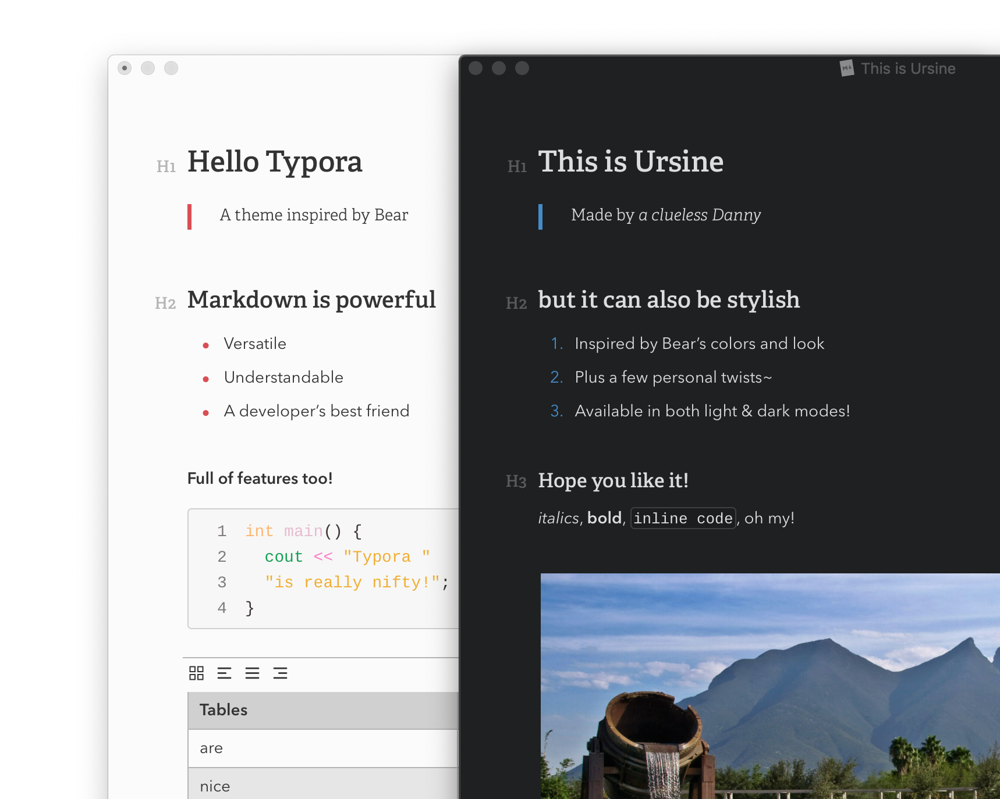

Uses the *Input* font family, & the colors are based on Bear's *Red Graphite* and *Dark Graphite* themes.
- *Input Sans* for paragraphs
- *Input Serif* for headings
- *Input Mono* for code blocks

Code fence themes are adapted from CodeMirror's *3024 Day* and *Dracula* themes for Ursine Polar and Umbra, respectively.

> Note: These themes have been designed and tested for both **MacOS & Windows** (though primarily Mac).

## Preview

<details>
<summary>Ursine Polar</summary>

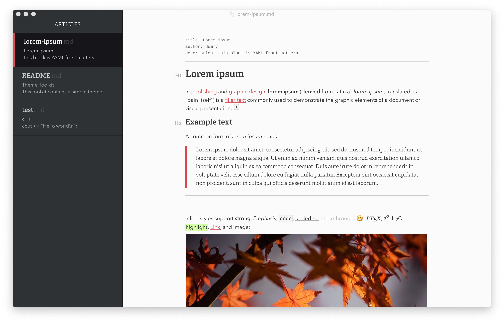
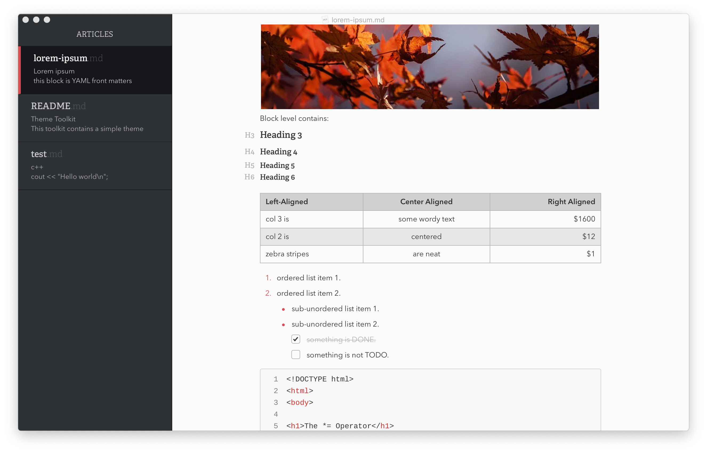
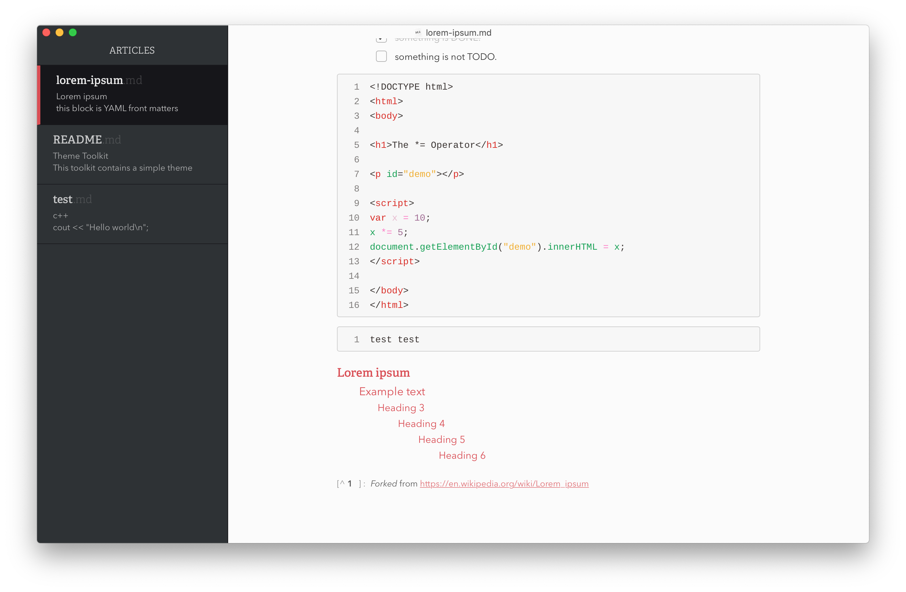
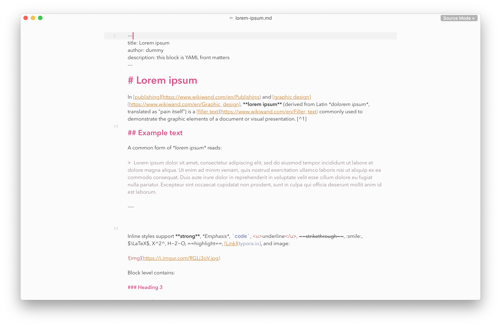

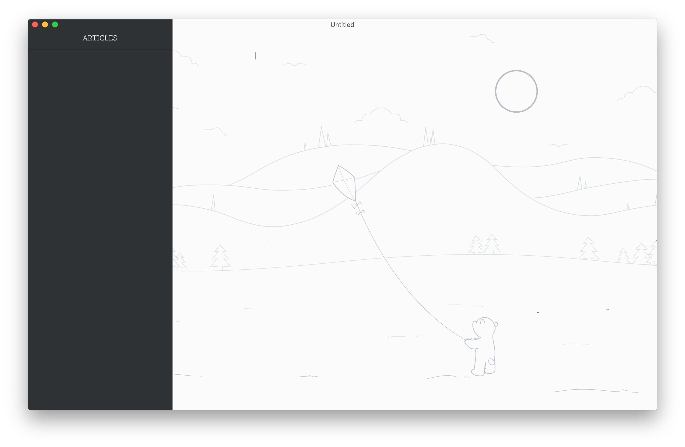

</details>

<details>
<summary>Ursine Umbra</summary>

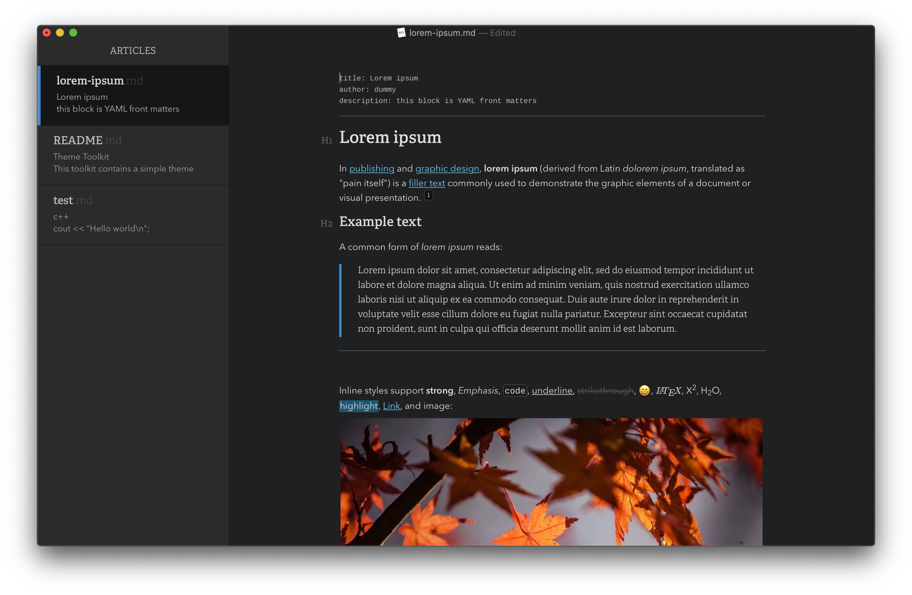
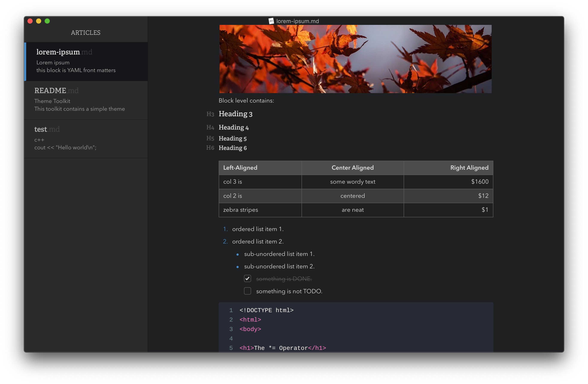
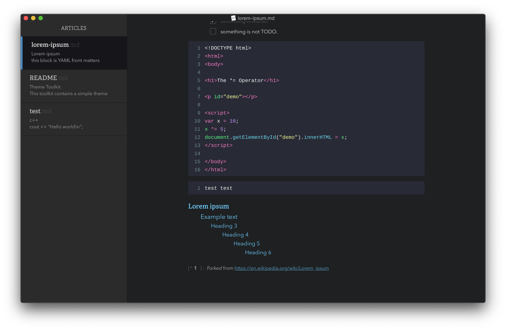
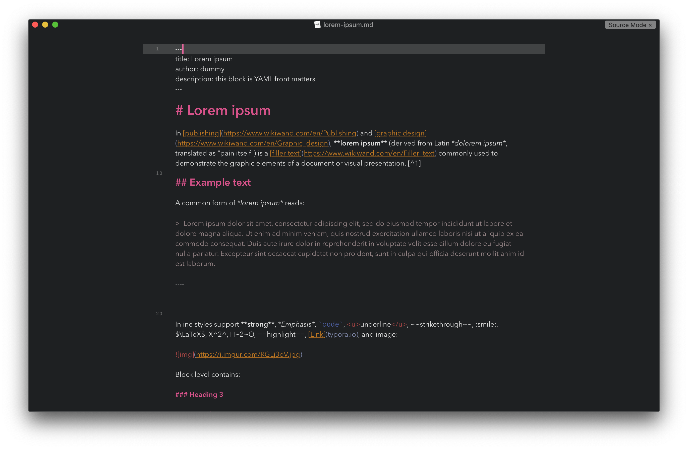

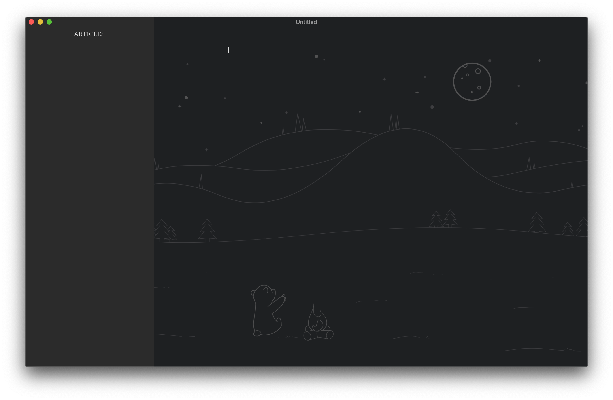

</details>

## Build

Ursine has recently switched to developing in [Sass](https://sass-lang.com/) and [Gulp.js](https://gulpjs.com/), so the repo no longer holds the direct CSS files for the sake of keeping the repo's filetree clean.

If you wish to manually build the theme (and maybe add your own touches in the process), you'll need `npm` & run the following commands:

```bash
npm i
gulp
```

The compiled CSS files will be located in the `/dist` directory once complete.

Three is also a `dev` script that will watch the files and assets & update your themes in your themes folder directly as you save your changes. Simply run `gulp dev` to do so (and remember to reselect the theme in Typora afterwards to see the changes).

### Related

- If you like Ursine, but need a `RTL` theme, check out [sadra's Middle East theme!](https://github.com/sadra/middle-east)
